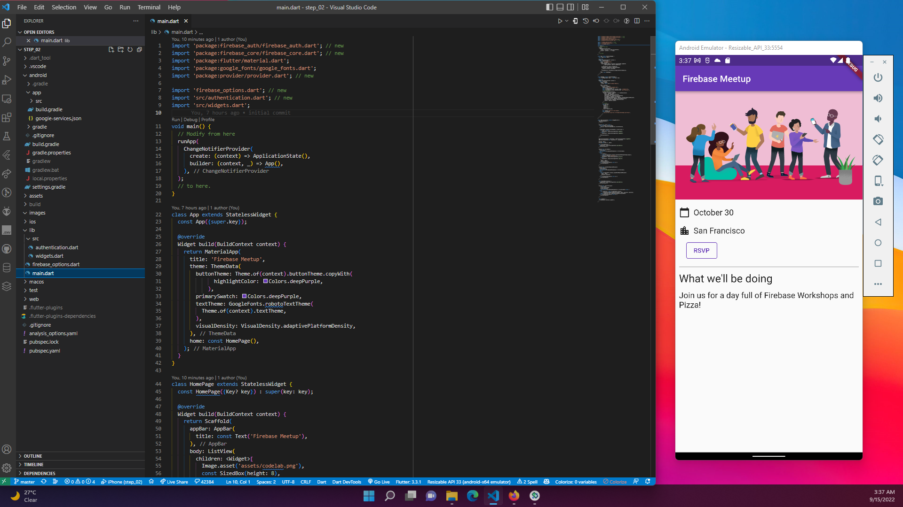
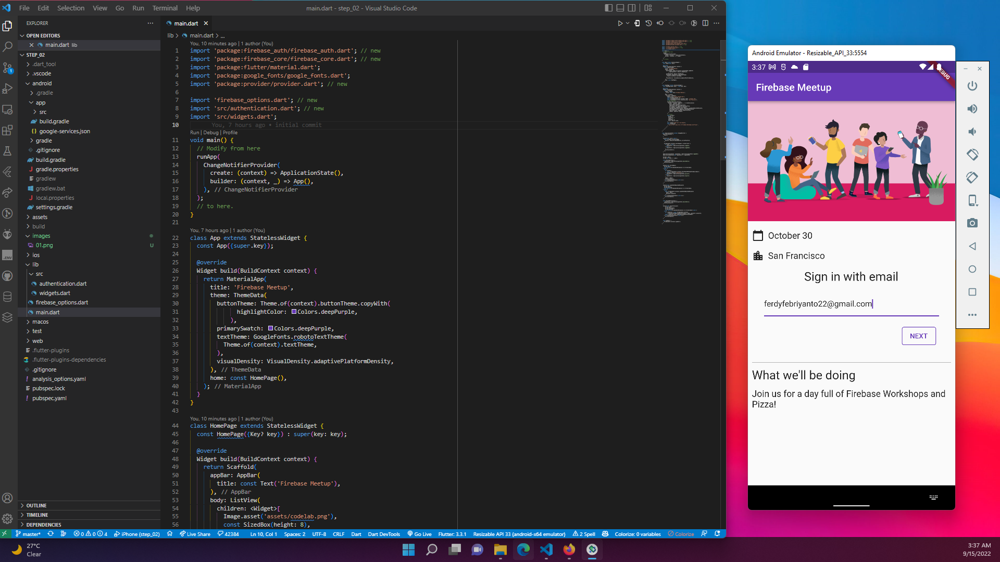
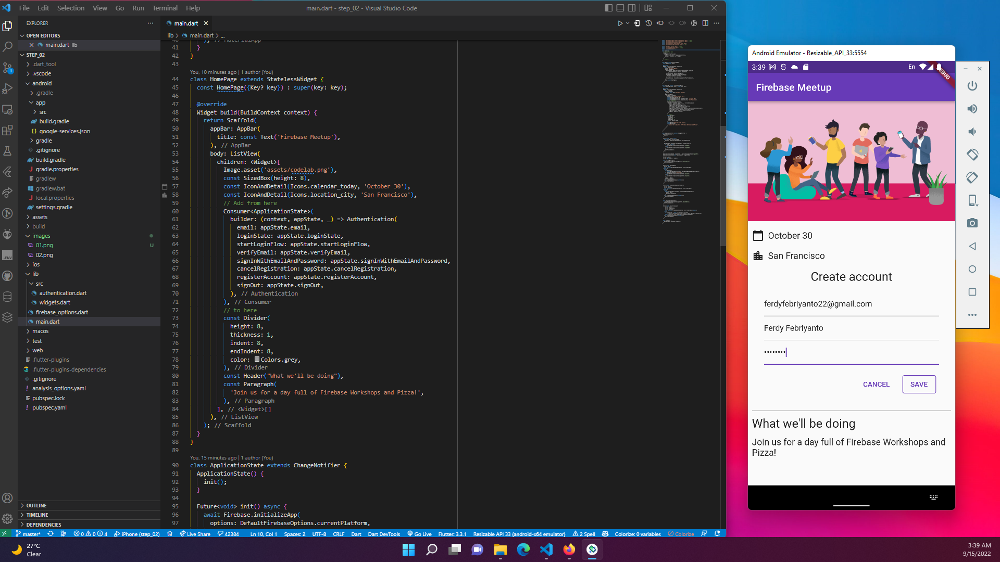
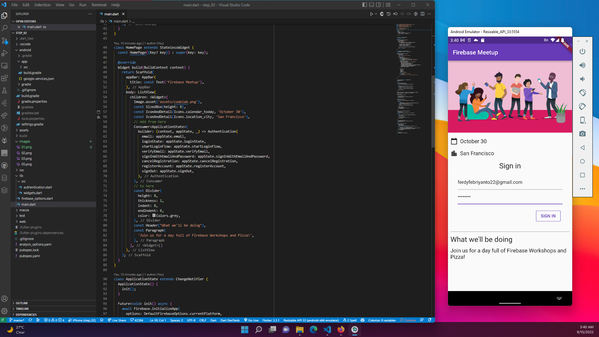
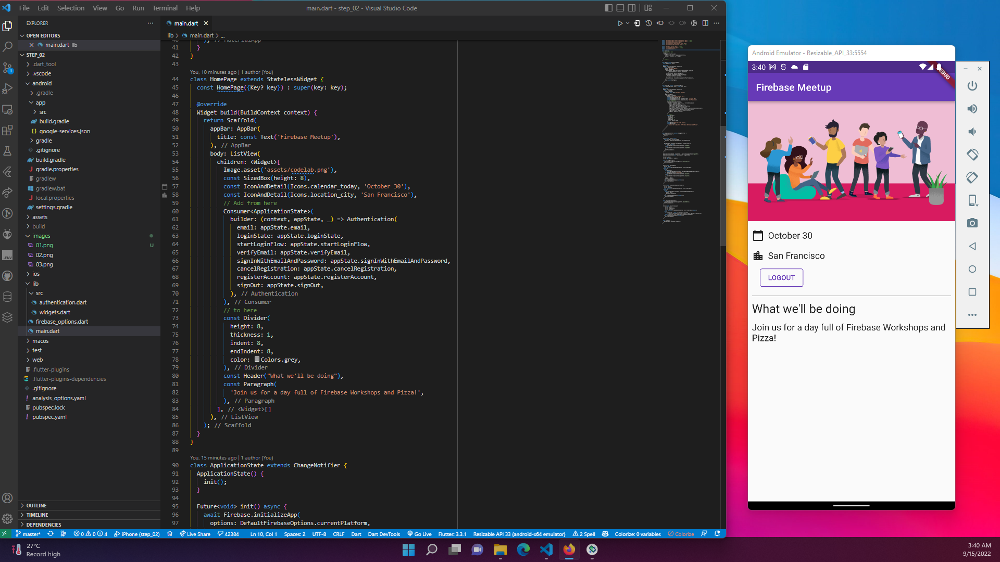

# #29 | Codelab: Firebase Flutter Plugin Bagian 2 

## Studi Kasus

* Membuat aplikasi obrolan RSVP dan buku tamu acara di Android, iOS, Web, dan MacOS menggunakan Flutter.
* Mengautentikasi pengguna dengan Firebase Authentication dan menyinkronkan data menggunakan Cloud Firestore. 

## Tujuan Praktikum

* Mahasiswa mampu memanfaatkan sikronisasi data menggunakan Cloud Firestore
* Mahasiswa mampu membuat pesan chat sederhana dengan plugin cloud firestore

## Link Praktikum

Berikut ini adalah link untuk praktikum: [link](https://firebase.google.com/codelabs/firebase-get-to-know-flutter?hl=id#1)

# Praktikum

## 1. Menambahkan Login Pengguna (RSVP)

* Berikut adalah awal dari alur otentikasi, di mana pengguna dapat menekan tombol RSVP, untuk memulai formulir email. 

* Setelah memasukkan email, sistem mengkonfirmasi jika pengguna sudah terdaftar, dalam hal ini pengguna dimintai kata sandi, atau jika pengguna tidak terdaftar, maka mereka pergi melalui formulir pendaftaran. 

* Pastikan untuk mencoba memasukkan kata sandi pendek (kurang dari enam karakter) untuk memeriksa alur penanganan kesalahan. Jika pengguna terdaftar, mereka akan melihat kata sandi sebagai gantinya. 

* Setelah pengguna berhasil masuk, mereka akan melihat halaman RSVP. 

* Pengguna dapat klik logout untuk keluar dari aplikasi.

## 2. Menulis pesan ke Cloud Firestore

Model Data

